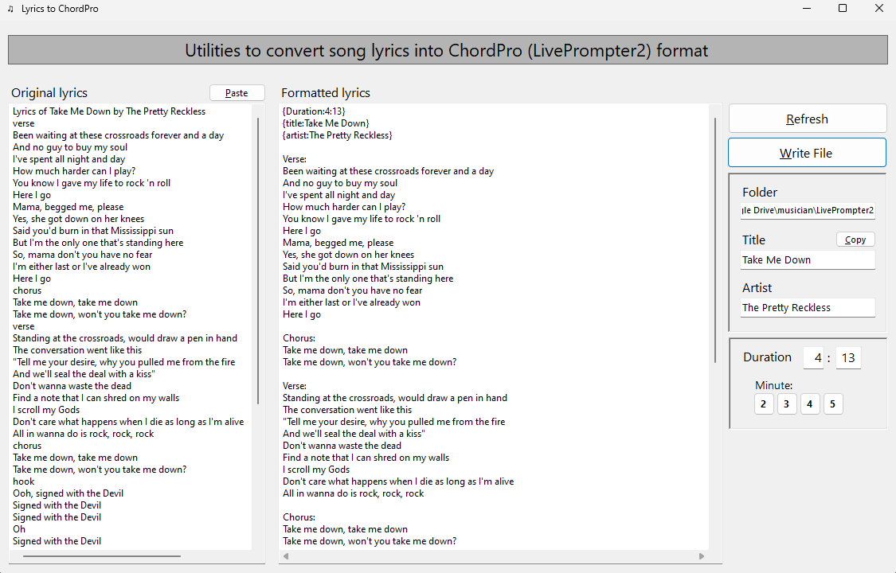
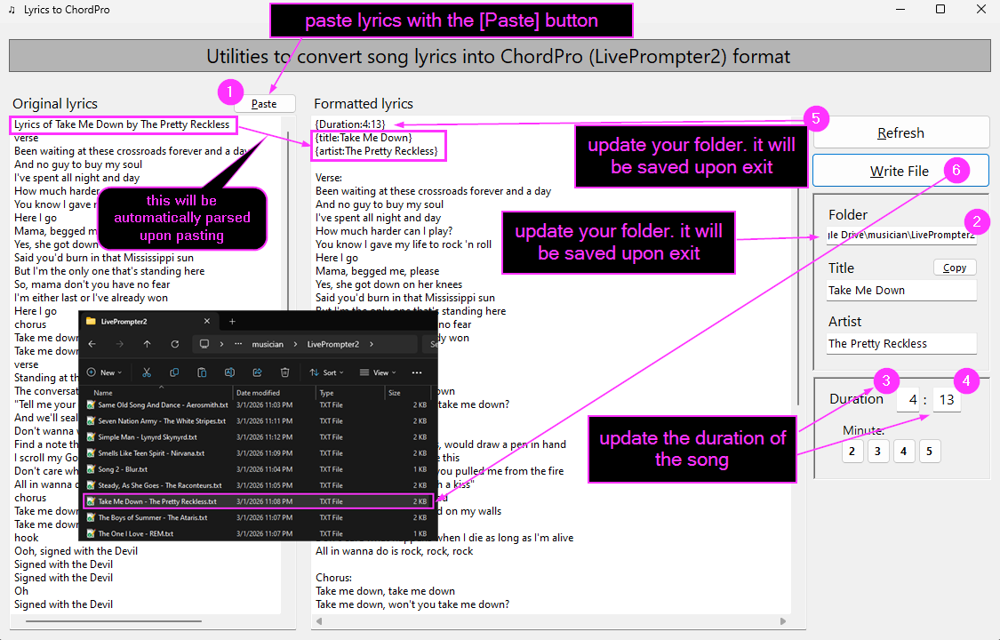
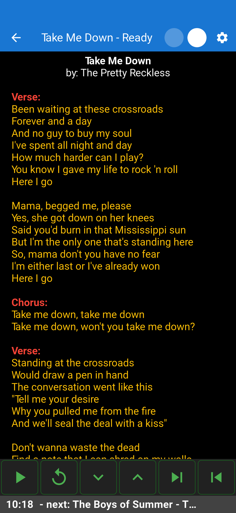

# Lyrics 2 ChordPro

2026-03-07 Brent Minder

Convert plain song lyrics into the ChordPro-friendly format used by apps such as LivePrompter2. 
This small Windows app parses pasted lyrics, extracts basic metadata (title/artist), normalizes line endings, and writes a ChordPro-compatible text file.

It's currently set to parse content specifically from musixmatch.com.

Example input:
```text
Lyrics of Tequila Sunrise (2013 Remaster) by Eagles
verse
It's another tequila sunrise
Starin' slowly 'cross the sky
Said goodbye
He was just a hired hand
Workin' on the dreams he planned to try
The days go by
chorus
Every night when the sun goes down
Just another lonely boy in town
...
```

Screenshot 1: main window with input lyrics


Screenshot 2: diagrammed output with explanations of the editing steps


Screenshot 3: LivePrompter2 output on Pixel 6 Pro phone



Features
- Normalize pasted lyrics and common Unicode line separators
- Parse "Lyrics of <title> by <artist>" headers
- Allows you to insert a duration tag (minutes:seconds) so LivePrompter2 can calculate the scroll speed.
- Mark common section headings (verse, chorus, bridge, etc.) as song sections
- Write formatted ChordPro text files to disk

Requirements
- Windows 10/11 or later
- .NET 10 SDK / runtime

Building
- Using the command line:
  - `dotnet build`

Running
- Launch from Visual Studio 2026 / Visual Studio Code / Rider / JetBrains or run from the command line with `dotnet run` in the project directory.

Usage
- Paste or type the original lyrics in the "Original lyrics" box.
- The app will normalize line endings automatically when pasting and when refreshing.
- If the first line matches the pattern `Lyrics of <title> by <artist>`, the app will populate the title and artist fields.
- Adjust minutes and seconds to set the `{Duration:MM:SS}` tag.
- Click `Refresh` to reformat the lyrics, and `Write File` to save the ChordPro-formatted text file.
- If you need to tweak the output, edit the left window content so that if you [Refresh] it will re-apply the formatting rules to your changes.

Contributing
- Fork the repository, make changes on a feature branch, and open a pull request. Keep changes small and focused.

License
- MIT — free use. If you fork this code, please give credit to the original author (Brent Minder) and link back to the original repository.


